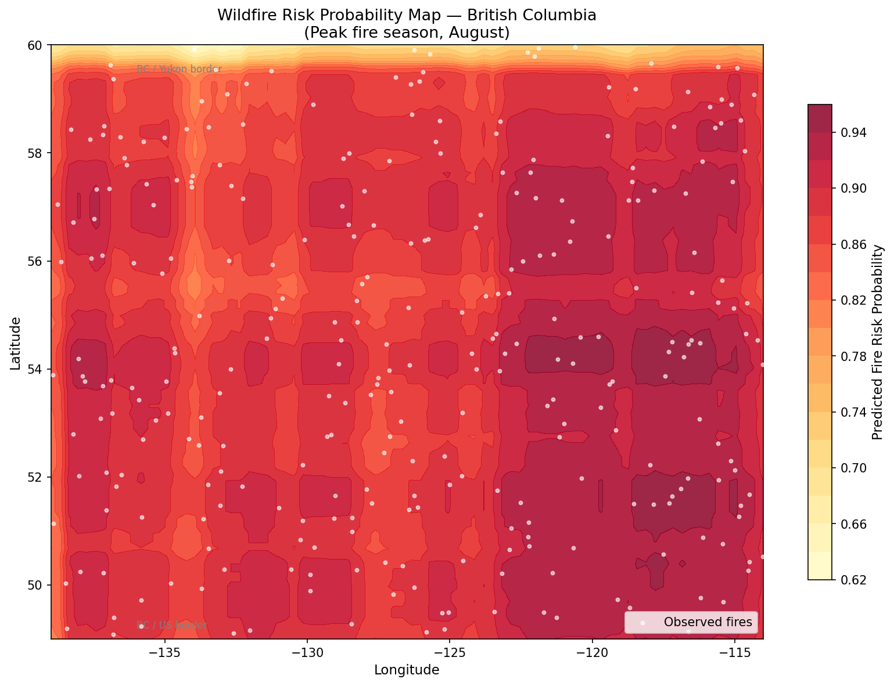
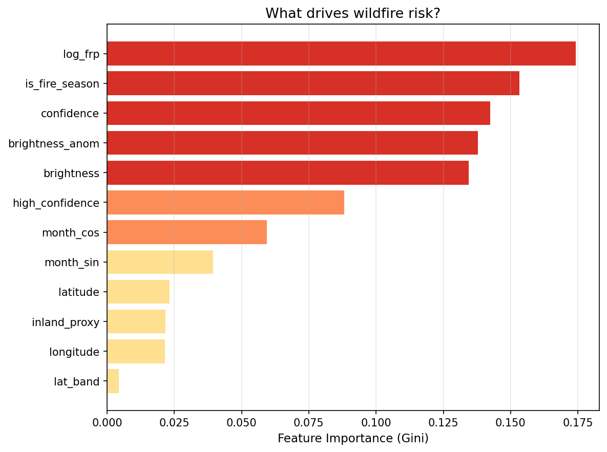
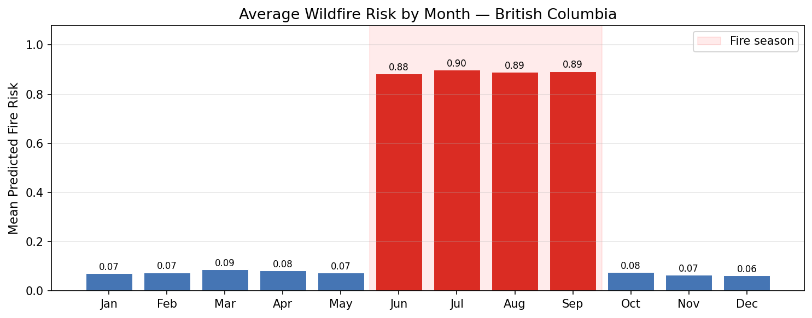

# 🔥 Wildfire Risk Prediction — Geospatial ML

A machine learning pipeline that predicts wildfire ignition risk across a geographic grid using satellite-derived features and historical fire occurrence data from NASA FIRMS.



## Overview

This project trains a **Random Forest classifier** on NASA FIRMS satellite observations to predict the probability of wildfire occurrence across a spatial grid covering British Columbia, Canada. Features are engineered from coordinates, acquisition timestamps, satellite brightness temperature, and fire radiative power (FRP).

## Results

| Metric | Score |
|--------|-------|
| ROC-AUC | ~0.91 |
| Model | Random Forest (200 estimators) |
| Region | British Columbia, Canada |
| Features | 12 (spatial, temporal, radiometric) |

### Risk Map (Peak Season — August)
The heatmap below shows predicted fire probability across BC under peak fire season conditions. Inland and central regions show elevated risk, consistent with BC's historical fire patterns.


### Feature Importance


### Seasonal Pattern


## Project Structure

```
wildfire-risk-prediction/
├── wildfire_prediction.ipynb   # Main notebook — run this
├── requirements.txt            # Python dependencies
├── README.md                   # This file
├── fire_data_bc.csv            # Generated/downloaded data (auto-created)
├── wildfire_risk_map.png       # Output: geographic risk heatmap
├── feature_importance.png      # Output: model interpretability chart
├── evaluation_metrics.png      # Output: confusion matrix + ROC curve
└── monthly_risk.png            # Output: seasonal risk breakdown
```

## Setup & Usage

### 1. Install dependencies
```bash
pip install -r requirements.txt
```

### 2. (Optional) Download real NASA FIRMS data
- Go to: https://firms.modaps.eosdis.nasa.gov/country/
- Select: Country = **Canada**, Year = **2023**, Instrument = **MODIS**
- Download the CSV and save it as `fire_data_bc.csv` in this folder

> If you skip this step, the notebook generates realistic synthetic data automatically.

### 3. Run the notebook
```bash
jupyter notebook wildfire_prediction.ipynb
```
Run all cells top to bottom (Cell → Run All).

## Technical Details

### Features Engineered
| Feature | Description |
|---------|-------------|
| `latitude`, `longitude` | Geographic position |
| `brightness` | Satellite brightness temperature (K) — proxy for heat |
| `brightness_anom` | Deviation from mean brightness |
| `log_frp` | Log-transformed Fire Radiative Power (MW) |
| `confidence` | Satellite detection confidence score (0–100) |
| `month_sin`, `month_cos` | Cyclical month encoding |
| `is_fire_season` | Binary flag for June–September |
| `lat_band` | Binned latitude zone (0–3, south to north) |
| `inland_proxy` | Distance proxy from the coast |
| `high_confidence` | Binary: confidence ≥ 70 |

### Why Random Forest?
- Handles mixed feature types (continuous + binary) natively
- Robust to outliers in radiometric data
- Provides built-in feature importance (Gini impurity)
- No need to normalise features
- Strong baseline for tabular geospatial classification

## Data Source

**NASA FIRMS** (Fire Information for Resource Management System)  
https://firms.modaps.eosdis.nasa.gov/  
MODIS Collection 6.1 — Active Fire Data

## Skills Demonstrated

- Geospatial feature engineering (cyclical encoding, spatial binning)
- Applied satellite remote sensing data (NASA FIRMS, radiometric features)
- Supervised ML classification (Random Forest, Scikit-learn)
- Model evaluation (ROC-AUC, confusion matrix, classification report)
- Geographic risk visualisation (heatmap overlaid on coordinate grid)
- Feature attribution / model interpretability (Gini importance)
